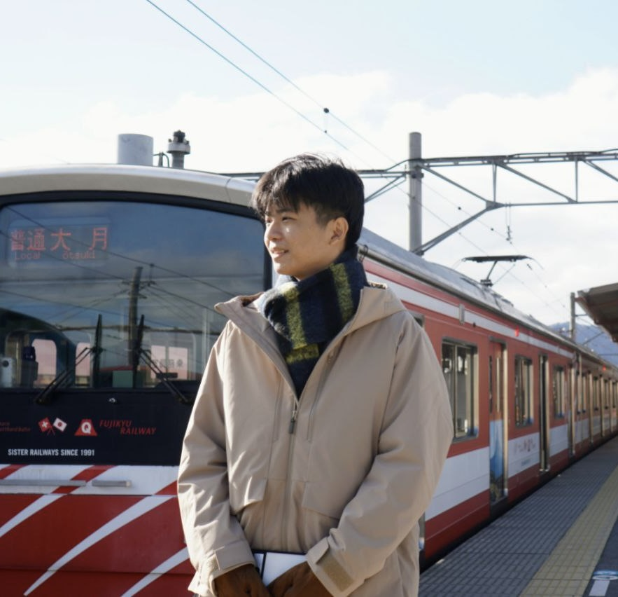

# Introduction

Hi! I'm Choo Xiang Lun, a final-year Software Engineering student, and I am taking the Software Maintenance and Evolution course this semester. I expect to learn a lot about modern software maintenance practices and how to work with legacy systems.

- **Fun fact**: I'm using a Nokia phone.
- **Course expectations**: To gain knowledge of how software evolves over time, the challenges associated with it, and how to maintain them in the long run.

## GitHub Profile

You can view my personalized GitHub profile [here](https://github.com/XiangLun0713).

